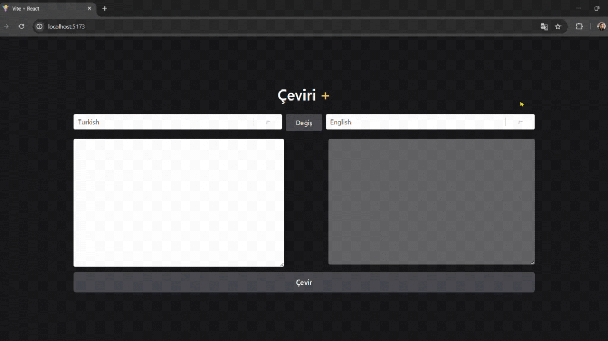

# Translate-App

In this project, a translation application was built using React, Redux Toolkit, and thunk. Users can translate text between different languages and swap languages. The application fetches language options from an API and translates the text to the target language.

## Libraries

- axios
- @reduxjs/toolkit
- react-redux
- react-select
- tailwind

## Gif

### API

- https://rapidapi.com/dickyagustin/api/text-translator2
